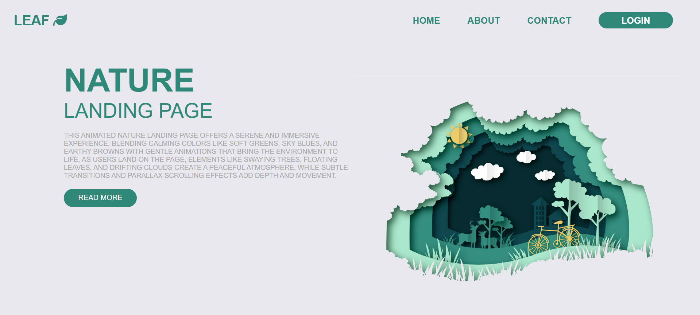

# Landing Page - Green Leaf Nature
This is a beautifully crafted Green Leaf Nature Landing Page that provides a Calm, Immersive User Experience. 
With Soothing colors, Nature-themed Visuals and Subtle Animations, it's perfect for Eco brands, Wellness Websites or Environmental Initiatives.

## Features

-  Nature-inspired layout with a paper-cut style illustration

- Soft, calming color palette (greens, sky blues, earthy tones)

- Elements like sun, trees, deer, clouds and bicycle

- Fixed header with navigation (Home, About, Contact, Login)

- Descriptive content with a clean "Read More" CTA button

- Optionally supports animations, transitions and parallax effects

## Tech Stack

- HTML5 – Semantic structure

- CSS3 – Styling and layout

- Custom Fonts/Icons – For logo and button enhancement

- Optional: Scroll animations or JavaScript for dynamic effects (not shown in screenshot)

## Screenshots

Below is a Preview of **Landing Page - Green Leaf Nature**, Showcasing the Layout and Styling implemented Using pure HTML , CSS & Javascript. 
The Design focuses on Clean Structure, Responsiveness and Modern Styling.

